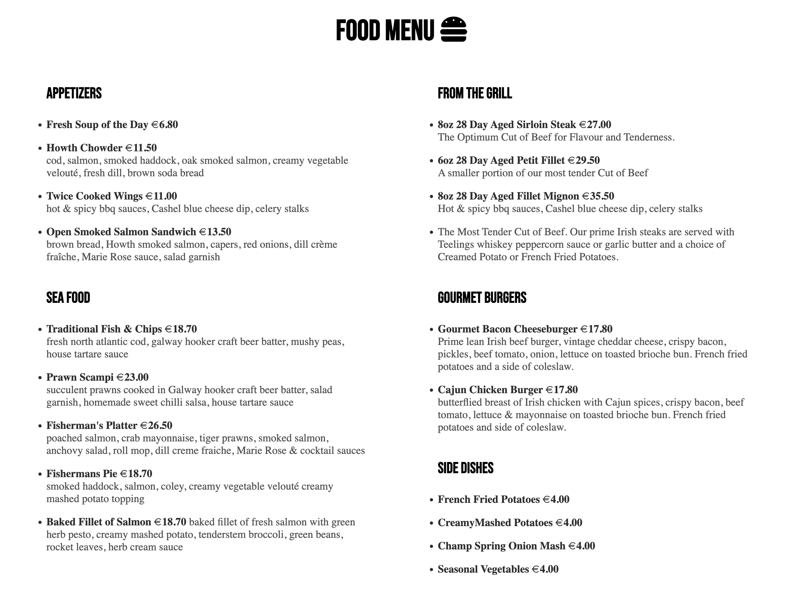
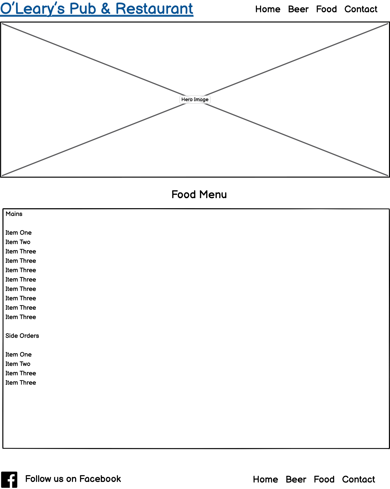

# O'Leary's Irish Pub & Restaurant

O'Leary's Irish Pub & Restaurant is a site to promote an Irish pub that hopes to bring a little bit of Ireland to the people of The Netherlands. The site will be targeted toward lovers of Irish beer & food living or traveling to The Netherlands.

You will see a selection of Irish beer & food on the site and be able to submit a booking!

---

# Features

+ **Navigation Bar**

  + Featured on all pages, the full responsive navigation bar includes links to the Logo, Home page, Beer page, Food page and the Contact page and is identical in each page to allow for easy navigation.
  
  + This section will allow the user to easily navigate from page to page across all devices 

+ **The Home page**

  + This section introduces the user to O'Leary's Irish Pub with info about the beer & food on offer

+ **The Pub Section**

  + This section introduces the user to details regarding the pub 
  

+ **The Food Section**

  + This section introduces the user to details regarding the food on offer
  

+ **The Beer Section**

  + This section introduces the user to details regarding the beer on offer
  

+ **The Footer**

  + This section has a menu for site navigation.
  + The section also includes a Facebook social link that will open up in a new tab for easy navigation.
  

+ **The Beer page**

  + This section introduces the user to the beer menu available
  
  + This section includes a form to make a table booking which redirects to a succes page once the requested info has been submitted. 

+ **The Food page**

  + This section introduces the user to the food menu available
  
  + This section includes a form to make a table booking which redirects to a succes page once the requested info has been submitted. 

+ **The Contact page**

  + This section uses a google map to display the location of O'Leary's Pub in Utrecht, The Netherlands
  
  + This section includes a form to make a table booking which redirects to a succes page once the requested info has been submitted.

___

## Future Features

+ Add individual beer pages with more information
___

## Typography & Colour Scheme
+ Headlines are the Bebas Neue font
+ Body and Subheadings are the Montserrat font
+ The colour scheme is monochromatic with the base being black #000
___

## Wireframes

+ Homepage

+ Beer Page

+ Food Page

+ Contact Page

___

# Technology

+ HTML
+ CSS
___

# Testing

+ Lighthouse
  + The site has been tested with Lighthouse and is 100% Accessible 

+ Responsive design
  + The site has been tested on all screen sizes and is responsive
___
# Validator Testing

+ HTML
  + No errors were returned when passing through the official W3C validator 
+ CSS
  + No errors were found when passing through the official (Jigsaw) validator

___
# Bugs

+ HTML
  + Found some issues with the form redirection before deyployment but fixed them all.

  ___
# Deployment

+ The site was developed in Gitpod. 
+ The site was deployed to GitHub pages. 

The live link can be found here - <https://artcuddy.github.io/Project1-olearys/index.html>

  ___
# Credits

+ Content
  + All icons are from [Font Awesome](https://fontawesome.com/ "Font Awesome")

+ Media
  + Images [Unsplash](https://unsplash.com/ "Unsplash")
  + Some images have been taken by me